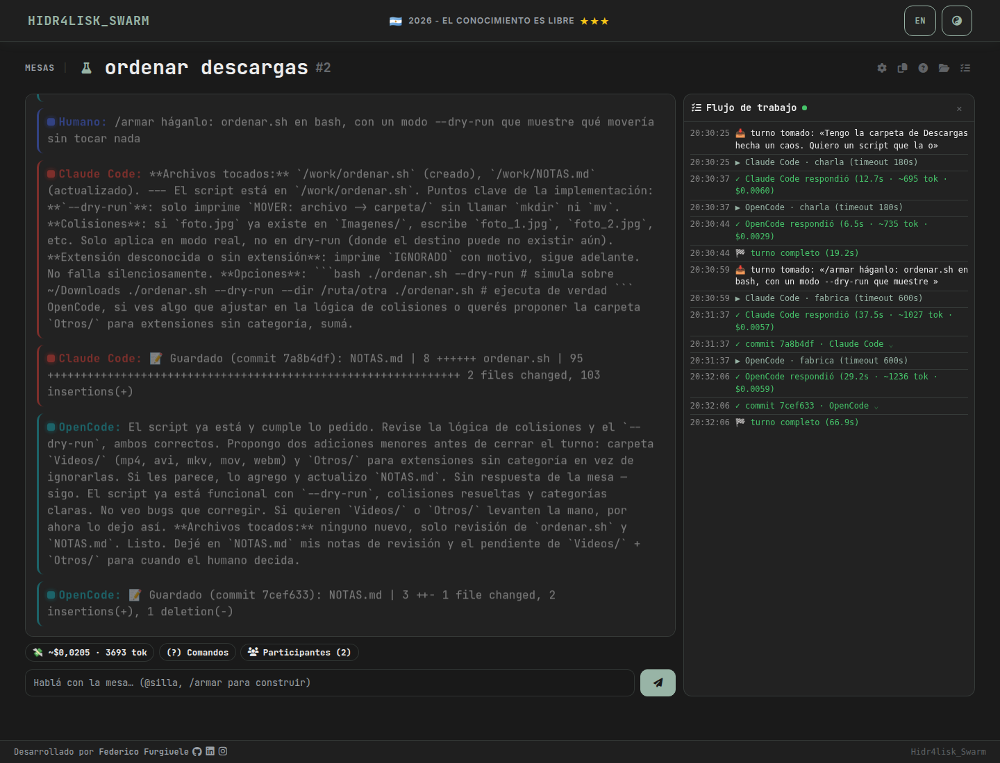
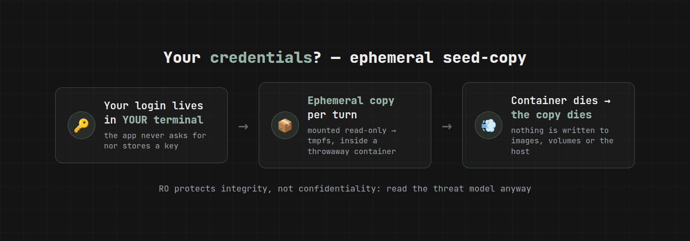
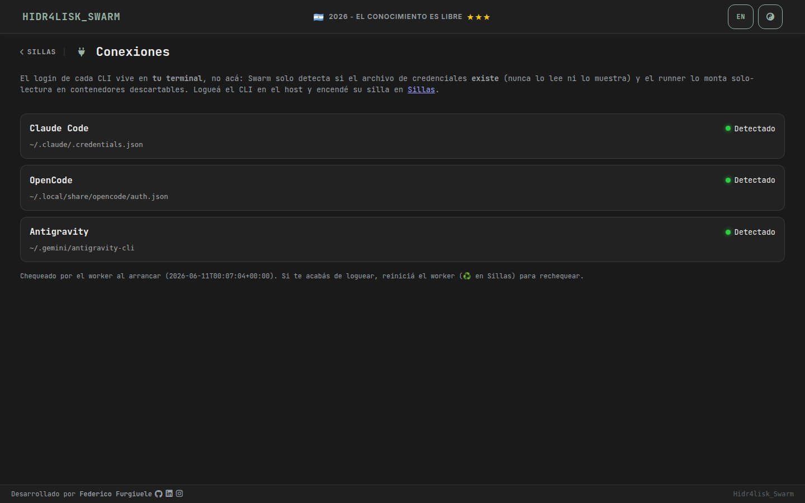
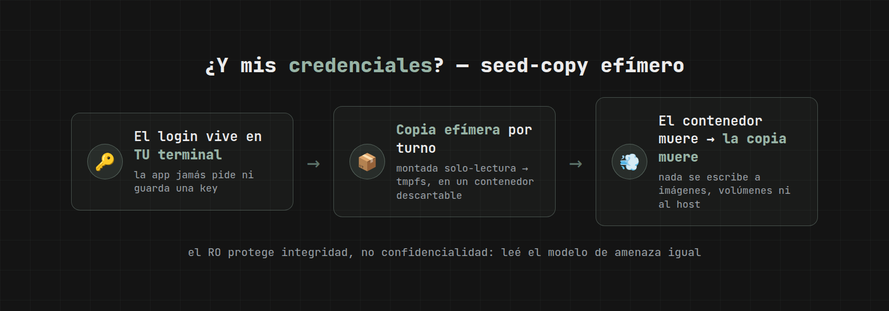

# Hidr4lisk_Swarm

**English** | [Español](#hidr4lisk_swarm--español)

A **multi-agent worktable** in your browser: several AIs sit at the same table —
**chat, debate and act** — coordinated by a leader. Run them on your already-logged-in
**CLIs** (`claude`, `opencode`, `agy`) or on your own **API keys** (Anthropic,
OpenAI-compatible, OpenRouter). **Install it, or carry the whole thing on a pendrive**
and plug it into any bare PC — Windows or Linux, no Python, no Docker.

🌐 **Project page:** <https://hidr4lisk.github.io/swarm>



> The UI is bilingual (EN/ES button in the navbar) — though its soul speaks Spanish,
> *rioplatense* to be precise.

## Quickstart

Two ways to run it — pick the one that fits the machine in front of you.

### Route A — Native / portable (no Docker) · Linux & Windows

The lightest way, and the one that runs off a pendrive. Only needs Python 3.12 (or the
bundled runtime); seats run on **API keys** — no CLI binaries required.

```bash
git clone https://github.com/hidr4lisk/swarm.git && cd swarm
pip install -r requirements-portable.txt
python manage.py serve        # migrate + worker + web + browser, one process
```

`serve` opens **http://127.0.0.1:8799**. Go to **Conexiones → API keys**, load a key
(it's stored encrypted under a passphrase you choose — see the vault below), and start a
table. That's it: no Docker, no CLI, no account.

<details>
<summary><b>Build the portable pendrive (Linux + Windows in one folder)</b></summary>

```bash
./scripts/build_bundle.sh        # → dist/swarm-portable/
```

Copy `dist/swarm-portable/` to a pendrive. On any bare PC (no Python, no Docker):
double-click **`enjambre.sh`** (Linux) or **`Enjambre.bat`** (Windows) — the whole app
boots from the stick with a Python bundled per-OS, and the table opens in the browser.
Your DB and encrypted vault live in the stick's `data/` folder. Requires `bash`, `curl`
and `tar` to *build* (not to use); run the build on a machine with internet.

</details>

### Route B — Docker (isolated CLI seats) · Linux

If you want the **CLI seats** (`claude`, `opencode`, `agy`) sandboxed in throwaway
containers per turn. Requirements: **Linux**, Docker with compose, and at least one AI CLI
logged in **in your terminal**.

<details>
<summary><b>No Docker yet? Install it (Ubuntu/Debian)</b></summary>

```bash
# Docker Engine + compose plugin, from Docker's official repo
sudo apt-get update && sudo apt-get install -y ca-certificates curl
sudo install -m 0755 -d /etc/apt/keyrings
sudo curl -fsSL https://download.docker.com/linux/ubuntu/gpg -o /etc/apt/keyrings/docker.asc
sudo chmod a+r /etc/apt/keyrings/docker.asc
echo "deb [arch=$(dpkg --print-architecture) signed-by=/etc/apt/keyrings/docker.asc] https://download.docker.com/linux/ubuntu $(. /etc/os-release && echo "$VERSION_CODENAME") stable" | sudo tee /etc/apt/sources.list.d/docker.list > /dev/null
sudo apt-get update
sudo apt-get install -y docker-ce docker-ce-cli containerd.io docker-buildx-plugin docker-compose-plugin

# Run docker without sudo (compose mounts your ~/.enjambre and the docker.sock as you)
sudo usermod -aG docker $USER && newgrp docker
```

Other distros / macOS: see the [official guide](https://docs.docker.com/engine/install/).
Note: compose v2 is the `docker compose` subcommand (not the old `docker-compose`).

</details>

```bash
claude            # once, in your terminal: /login  (and/or `opencode auth login`, agy)
git clone git@github.com:hidr4lisk/swarm.git && cd swarm
docker compose up
```

Open **http://localhost:8080** → **Sillas → Conexiones** shows which CLIs were detected;
turn on the seats you have (they ship disabled, no keys). Heads-up: compose uses
**postgres** (its own volume) while the native route uses **SQLite** — two separate
databases, tables don't carry over between routes.

### Either route

Create a table (*mesa*) and ask away. With `/armar <request>` the table builds real files
in its git folder (`~/.enjambre/mesas/mesa-<id>`). The UI is bilingual — the **EN/ES**
button in the navbar switches language. The full usage guide — table commands (`@alias`,
`/armar`, `/debate`, `/continuo`, `/alto`…), flat/leader topologies and seat
configuration — lives in the app's **Help** button ([preview](docs/img/ayuda-en.png)).

Everything configurable comes in through environment variables with sane defaults:
see [.env.example](.env.example). Tests: `python manage.py test enjambre`.

## How it works

**Native / portable route** (`manage.py serve`): a single process does everything — migrate,
run the Enjambre **worker** in a thread, and serve the **web** (threaded, so each SSE turn gets
its own thread; no gevent). SQLite, no Docker, no `docker.sock`. API-key seats talk to the
providers over plain HTTP; there's no capsule — the [toolbelt](#threat-model--read-this-before-using-it)
acts on the real machine (that's the point). This is what the pendrive launchers run.

**Docker route** (`docker compose up`): the CLI seats are isolated in throwaway containers.

| Service | What it does | What it sees |
|---------|--------------|--------------|
| `web` | the table (queues messages, streams via SSE) | the DB and `~/.enjambre`; **no credentials, no docker.sock** |
| `db` | postgres | its own volume |
| `worker` | the real dispatch: launches a **runner** per turn | the DB, `~/.enjambre` and the **docker.sock**; passes credential paths around **without being able to read them** |
| runner | a **throwaway** container per CLI invocation | the CLI binary (RO), **its own** credential (RO → tmpfs copy) and the table's `/work` folder |

**Credentials** use an *ephemeral seed-copy*: your login on the host is the single
source of truth; each runner mounts the file read-only and a short, eyeball-auditable
[`entrypoint.sh`](runner/entrypoint.sh) copies it to a tmpfs that dies with the
container. Token refreshes never flow back to the host and never land in images or
volumes. Full detail in [runner/README.md](runner/README.md).





## Threat model — read this before using it

Swarm is **single-user, on your machine**. No sugarcoating:

- The `worker` container mounts **`/var/run/docker.sock`**, which is equivalent to
  **root access to your host**. It's what makes the throwaway runners possible with
  `docker compose up` and nothing else. Do not expose this compose to third parties.
- Agents run arbitrary commands inside the runner and **can read the mounted token**:
  read-only protects your credential's integrity, not its confidentiality. A confused
  or prompt-injected agent could exfiltrate it. Accepted because these are **your**
  accounts running **your** requests on **your** machine.
- Runner mitigations: one throwaway container per invocation, `--cap-drop ALL`
  (+`DAC_OVERRIDE`), `no-new-privileges`, pids/memory/cpu limits, tmpfs HOME.
- **CLI credentials** are never asked for, stored or logged; the Conexiones screen only
  reports whether the file **exists**. **API keys are the exception** — the portable
  route stores them, encrypted (see the vault below).
- **Linux-only** (Docker route): on macOS `claude` keeps the token in the Keychain (no file to mount).
- The web listens on `localhost:8080` with no human login: don't publish it as-is.

**API-key vault (portable route).** When you run sillas by **API key** instead of a CLI,
Swarm has to keep the keys — so it stores them **encrypted with a passphrase you choose**.
Your passphrase is stretched with **scrypt** into a key that encrypts `data/secrets.enc`
with **Fernet (AES)**; the passphrase itself is never stored on disk. Lose the pendrive
without the passphrase and there are no tokens in the clear. The first key you save sets
the vault's passphrase; the rest use the same one. Caveats, said plainly:

- **While the vault is *unlocked*** the decrypted keys live in a `0600` runtime file so the
  worker can dispatch — an agent running on that machine could read it, exactly like it can
  read a mounted CLI token. **Lock the vault** (Conexiones → API keys) when you're done. Same
  trust model as the CLI route: your keys, your requests, your machine.
- The passphrase protects the keys **at rest** (pendrive stolen while locked), **not** against
  an attacker who already controls the running machine.
- `data/secrets.enc` and the runtime file are git-ignored — they never reach the repo.

**Toolbelt — sillas operate the real system (opt-in, `SWARM_TOOLBELT`, off by default).** This
is the sharp edge of Swarm. When enabled, API-key sillas get tools that act on **the actual
machine you plugged into** — no container, no capsule. The safety net is **not** a sandbox; it is:

- **Read-only by default, auto-run.** `inspect` only runs binaries on a read-only allowlist,
  with **no shell** (pipes/redirects are inert) and a denylist for write-flags (`find -delete`).
  `read_file` / `list_dir` / `system_report` only read. These run without asking.
- **Every mutation needs a human OK.** `apply_fix` never executes on its own — it queues a
  pending action and posts a note in the mesa; you approve or reject it in the **Bitácora**.
  Approved commands run with a full shell **because you reviewed them**.
- **Everything is logged.** Every read and every mutation lands in the per-mesa Bitácora
  (the `Accion` model), exportable as a support report.
- **This is a powerful, dangerous tool in the wrong hands.** Only enable it on machines you're
  authorized to service, and read every `apply_fix` before approving. In Docker mode the tools
  see the worker container, not the host — the toolbelt is meant for the **native/portable** route.

Known limitation: containers run as root, so the files tables build under `~/.enjambre`
end up root-owned on your host (git even complains about *dubious ownership* if you
touch them as your user). It doesn't affect the app; to work on them from your
terminal: `sudo chown -R $USER ~/.enjambre`.

## License

MIT — see [LICENSE](LICENSE).

Built by [Federico Furgiuele](https://github.com/hidr4lisk).

---

# Hidr4lisk_Swarm — Español

Una **mesa de trabajo multi-agente** en tu navegador: varias IAs se sientan a la misma
mesa — **charlan, debaten y actúan** — coordinadas por un líder. Corrélas sobre tus
**CLIs** ya logueados (`claude`, `opencode`, `agy`) o sobre tus propias **API keys**
(Anthropic, compatible-OpenAI, OpenRouter). **Instalalo, o llevate todo en un pendrive**
y enchufalo en cualquier PC pelada — Windows o Linux, sin Python, sin Docker.

🌐 **Página del proyecto:** <https://hidr4lisk.github.io/swarm>

## Quickstart

Dos formas de correrlo — elegí la que le sirve a la máquina que tenés enfrente.

### Ruta A — Nativa / portátil (sin Docker) · Linux y Windows

La más liviana, y la que corre desde un pendrive. Solo necesita Python 3.12 (o el runtime
bundleado); las sillas corren sobre **API keys** — sin binarios de CLI.

```bash
git clone https://github.com/hidr4lisk/swarm.git && cd swarm
pip install -r requirements-portable.txt
python manage.py serve        # migra + worker + web + navegador, un proceso
```

`serve` abre **http://127.0.0.1:8799**. Andá a **Conexiones → API keys**, cargá una key
(se guarda cifrada con una passphrase que elegís vos — ver la bóveda abajo) y armá una
mesa. Listo: sin Docker, sin CLI, sin cuenta.

<details>
<summary><b>Armar el pendrive portátil (Linux + Windows en la misma carpeta)</b></summary>

```bash
./scripts/build_bundle.sh        # → dist/swarm-portable/
```

Copiá `dist/swarm-portable/` a un pendrive. En cualquier PC pelada (sin Python, sin Docker):
doble-clic a **`enjambre.sh`** (Linux) o **`Enjambre.bat`** (Windows) — el app entero
arranca desde el pendrive con un Python bundleado por SO, y la mesa abre en el navegador.
Tu DB y tu bóveda cifrada viven en la carpeta `data/` del pendrive. Para *armarlo* (no para
usarlo) hace falta `bash`, `curl` y `tar`; corré el build en una máquina con internet.

</details>

### Ruta B — Docker (sillas de CLI aisladas) · Linux

Si querés las **sillas de CLI** (`claude`, `opencode`, `agy`) aisladas en contenedores
descartables por turno. Requisitos: **Linux**, Docker con compose, y al menos un CLI de IA
logueado **en tu terminal**.

<details>
<summary><b>¿No tenés Docker? Instalalo (Ubuntu/Debian)</b></summary>

```bash
# Docker Engine + plugin compose, desde el repo oficial de Docker
sudo apt-get update && sudo apt-get install -y ca-certificates curl
sudo install -m 0755 -d /etc/apt/keyrings
sudo curl -fsSL https://download.docker.com/linux/ubuntu/gpg -o /etc/apt/keyrings/docker.asc
sudo chmod a+r /etc/apt/keyrings/docker.asc
echo "deb [arch=$(dpkg --print-architecture) signed-by=/etc/apt/keyrings/docker.asc] https://download.docker.com/linux/ubuntu $(. /etc/os-release && echo "$VERSION_CODENAME") stable" | sudo tee /etc/apt/sources.list.d/docker.list > /dev/null
sudo apt-get update
sudo apt-get install -y docker-ce docker-ce-cli containerd.io docker-buildx-plugin docker-compose-plugin

# Usar docker sin sudo (compose monta tu ~/.enjambre y el docker.sock como tu usuario)
sudo usermod -aG docker $USER && newgrp docker
```

Otras distros / macOS: ver la [guía oficial](https://docs.docker.com/engine/install/).
Ojo: compose v2 es el subcomando `docker compose` (no el viejo `docker-compose`).

</details>

```bash
claude            # una vez, en tu terminal: /login  (y/o `opencode auth login`, agy)
git clone git@github.com:hidr4lisk/swarm.git && cd swarm
docker compose up
```

Abrí **http://localhost:8080** → **Sillas → Conexiones** te muestra qué CLIs quedaron
detectados; encendé las sillas que tengas (vienen apagadas, sin ninguna key). Ojo: el
compose usa **postgres** (con su volumen) mientras la ruta nativa usa **SQLite** — son dos
bases separadas, las mesas no se comparten entre rutas.

### En cualquier ruta

Creá una mesa y preguntá. Con `/armar <pedido>` la mesa fabrica archivos de verdad en su
carpeta git (`~/.enjambre/mesas/mesa-<id>`). La UI es bilingüe — el botón **ES/EN** de la
navbar cambia el idioma. La guía completa de uso — comandos de la mesa (`@alias`, `/armar`,
`/debate`, `/continuo`, `/alto`…), topologías plana/líder y configuración de sillas — vive
en el botón **Ayuda** de la app ([vista previa](docs/img/ayuda.png)).

Todo lo configurable entra por variables de entorno con defaults razonables:
ver [.env.example](.env.example). Tests: `python manage.py test enjambre`.

## Cómo funciona

**Ruta nativa / portátil** (`manage.py serve`): un solo proceso hace todo — migra, corre el
**worker** del Enjambre en un hilo y sirve la **web** (threaded, así cada turno SSE vive en su
hilo; sin gevent). SQLite, sin Docker, sin `docker.sock`. Las sillas por API key hablan con los
proveedores por HTTP plano; no hay cápsula — el [toolbelt](#modelo-de-amenaza--leelo-antes-de-usarlo)
actúa sobre la máquina real (esa es la idea). Es lo que corren los launchers del pendrive.

**Ruta Docker** (`docker compose up`): las sillas de CLI quedan aisladas en contenedores descartables.

| Servicio | Qué hace | Qué ve |
|----------|----------|--------|
| `web` | la mesa (encola mensajes, streamea por SSE) | la DB y `~/.enjambre`; **ni credenciales ni docker.sock** |
| `db` | postgres | su volumen |
| `worker` | el dispatch real: por cada turno lanza un **runner** | la DB, `~/.enjambre` y el **docker.sock**; pasa rutas de credenciales **sin poder leerlas** |
| runner | un contenedor **descartable** por invocación de CLI | el binario del CLI (RO), **su** credencial (RO → copia en tmpfs) y la carpeta `/work` de la mesa |

Las **credenciales** usan un *seed-copy efímero*: tu login en el host es la única
fuente de verdad; cada runner monta el archivo solo-lectura y un
[`entrypoint.sh`](runner/entrypoint.sh) corto y auditable lo copia a un tmpfs que
muere con el contenedor. Los refresh de token nunca vuelven al host ni quedan en
imágenes o volúmenes. Detalle completo en [runner/README.md](runner/README.md).



## Modelo de amenaza — leelo antes de usarlo

Swarm es **single-user en tu máquina**. Dicho sin vueltas:

- El contenedor `worker` monta **`/var/run/docker.sock`**, que equivale a **acceso
  root a tu host**. Es lo que permite lanzar los runners descartables con `docker
  compose up` y nada más. No expongas este compose a terceros.
- Los agentes ejecutan comandos arbitrarios dentro del runner y **pueden leer el
  token montado**: el RO protege la integridad de tu credencial, no su
  confidencialidad. Un agente confundido o prompt-injected podría exfiltrarla. Se
  acepta porque son **tus** cuentas corriendo **tus** pedidos en **tu** máquina.
- Mitigaciones en el runner: contenedor descartable por invocación, `--cap-drop ALL`
  (+`DAC_OVERRIDE`), `no-new-privileges`, límites de pids/memoria/cpu, HOME en tmpfs.
- Las **credenciales de CLI** jamás se piden, guardan ni loguean; la pantalla Conexiones
  solo reporta si el archivo **existe**. **Las API keys son la excepción**: la ruta
  portátil las guarda, cifradas (ver la bóveda abajo).
- **Linux-only** (ruta Docker): en macOS `claude` guarda el token en el Keychain (no hay
  archivo que montar).
- La web escucha en `localhost:8080` sin login humano: no la publiques tal cual.

**Bóveda de API keys (ruta portátil).** Cuando corrés sillas por **API key** en vez de un
CLI, Swarm tiene que guardar las keys — así que las guarda **cifradas con una passphrase que
elegís vos**. Tu passphrase se estira con **scrypt** hasta una clave que cifra
`data/secrets.enc` con **Fernet (AES)**; la passphrase en sí nunca se guarda en disco. Si se
pierde el pendrive sin la passphrase, no hay tokens en claro. La **primera** key que guardás
fija la passphrase de la bóveda; las siguientes usan la misma. Los peros, sin vueltas:

- **Mientras la bóveda está *desbloqueada***, las keys descifradas viven en un archivo runtime
  `0600` para que el worker pueda despachar — un agente corriendo en esa máquina podría leerlo,
  igual que puede leer un token de CLI montado. **Bloqueá la bóveda** (Conexiones → API keys)
  cuando termines. Mismo modelo de confianza que la ruta CLI: tus keys, tus pedidos, tu máquina.
- La passphrase protege las keys **en reposo** (pendrive robado estando bloqueada), **no**
  contra un atacante que ya controla la máquina en uso.
- `data/secrets.enc` y el archivo runtime están en `.gitignore` — nunca llegan al repo.

**Toolbelt — las sillas operan el sistema real (opt-in, `SWARM_TOOLBELT`, apagado por default).**
Es el filo de Swarm. Habilitado, las sillas por API key reciben herramientas que actúan sobre **la
máquina a la que enchufaste el pendrive** — sin contenedor, sin cápsula. La red de seguridad **no**
es un sandbox; es esto:

- **Read-only por default, auto.** `inspect` solo corre binarios de una allowlist de solo-lectura,
  **sin shell** (pipes/redirecciones son inertes) y con denylist de banderas que escriben
  (`find -delete`). `read_file` / `list_dir` / `system_report` solo leen. Corren sin preguntar.
- **Toda mutación necesita tu OK.** `apply_fix` nunca se ejecuta solo — encola una acción pendiente
  y lo avisa en la mesa; vos la aprobás o rechazás en la **Bitácora**. Los comandos aprobados corren
  con shell completo **porque ya los revisaste**.
- **Todo queda logueado.** Cada lectura y cada mutación va a la Bitácora de la mesa (modelo
  `Accion`), exportable como informe de soporte.
- **Es un tool de mucho poder, peligroso en manos equivocadas.** Habilitalo solo en máquinas que
  estés autorizado a atender, y leé cada `apply_fix` antes de aprobar. En modo Docker las
  herramientas ven el contenedor worker, no el host — el toolbelt es para la ruta **nativa/portátil**.

Limitación conocida: los contenedores corren como root, así que los archivos que las
mesas fabrican en `~/.enjambre` quedan de root en tu host (git incluso se queja de
*dubious ownership* si los tocás desde tu usuario). Dentro de la app no afecta; para
trabajarlos desde tu terminal: `sudo chown -R $USER ~/.enjambre`.

## Licencia

MIT — ver [LICENSE](LICENSE).

Desarrollado por [Federico Furgiuele](https://github.com/hidr4lisk).
